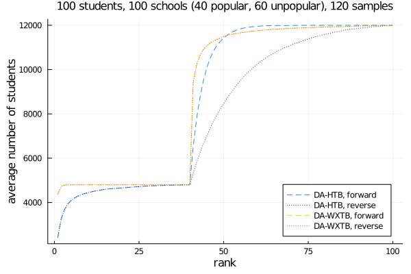
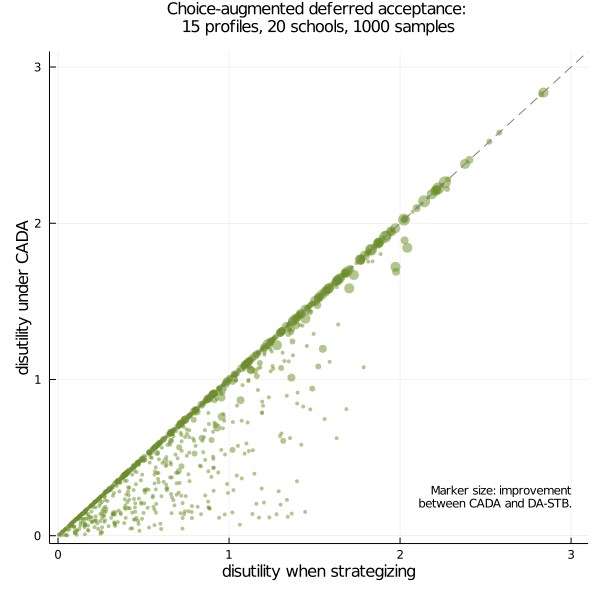
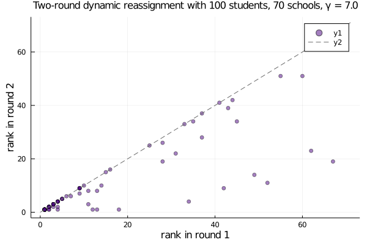
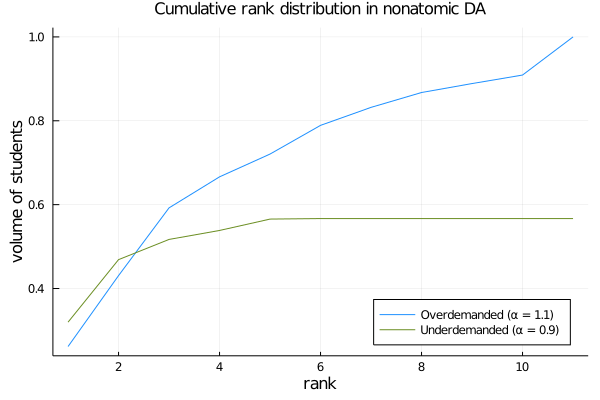
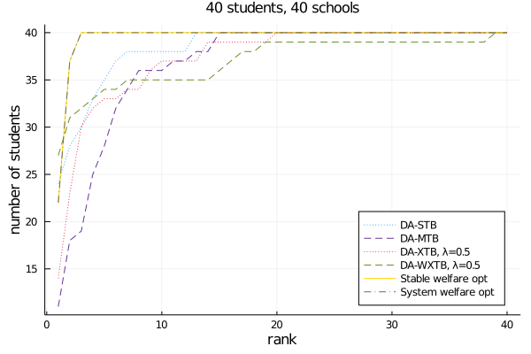

# DeferredAcceptance

&hellip; is an efficient Julia implementation of a few variations of the deferred acceptance (DA) algorithm, which produce stable, incentive-compatible solutions to school-choice problems.

The author&rsquo;s homepage is [maxkapur.com](https://www.maxkapur.com/).

## Background

In many public school systems, such as those in New York City, Boston, and Amsterdam, students apply for seats by supplying a strict ranking of the schools they would like to attend. Likewise, each school has a ranking of the students, favoring e.g. students who live nearby, have siblings at the school, or have high grades. Schools’ preferences are *not* strict. Each school places students of common favorability into categories and provides a ranking over the categories. In addition, each school has a limit on how many students it can accept, and we assume that schools would prefer any student over an empty seat. Each student may be assigned to at most one school.

The school-choice problem is, given the students’ and schools’ preference lists, what is the best way to assign students to schools? If every student and school has a strict preference list, we can use DA to find a stable assignment (it is often unique). But to address the general case, there are a family of tiebreaking mechanisms that we can use to convert loose preference lists into strict ones.

This module includes my most performant implementation of vanilla DA in forward and reverse forms. It includes a forward implementation of nonatomic DA. I also provide utilities for a wide range of tiebreaking rules and replications of several recent experimental results.

## Comparison of tiebreaking mechanisms

Here is a cool graph, produced by the script `examples/Hybrid.jl`:

It compares the cumulative rank distributions associated with various DA tiebreaking rules in a simulated school-choice market involving 120 students and 120 seats. In overdemanded (popular) schools, single tiebreaking (STB) yields both better student welfare and greater equity than multiple tiebreaking (MTB), but MTB produces a more equitable distribution in underdemanded schools. A hybrid tiebreaking rule yields the best of both, but requires clairvoyance about which schools are popular and unpopular, a distinction that is less clear in real-world data (Ashlagi and Afshin 2020). Thus, a tiebreaking rule of my own creation (convex tiebreaking, XTB), parameterized in &lambda;, allows the market designer to freely modulate the welfare&ndash;equity tradeoff between MTB and STB without prior information about the relative popularity of the schools.

To discover a further extreme of the welfare-equality tradeoff phenomenon in underdemanded markets, we can use the student preference lists as primary tiebreakers; then, any of the four methods above can be used to break the remaining ties. This welfare tiebreaking rule (WTB) reflects the realistic assumption that a given school marginally prefers students who prefer it. WTB dominates STB in overdemanded markets, and in all markets, the difference between WXTB and WHTB (that is, WTB where secondary tiebreaking is performed by XTB or HTB, respectively) vanishes. WSTB is known as the &ldquo;Boston mechanism&rdquo; and is popular among parents even though it is not strategy proof; see [Target schools](#target-schools) below for a possible workaround after Abdulkadiroğlu et al. (2015).

## Student optimality

It is not to difficult to show that student-proposing (forward) DA is student optimal&mdash;that is, if both sets of preference orders are strict, student-proposing DA maximizes total student welfare (negative sum of ranks) subject to stability. An area of interest is the welfare cost of using school-proposing (reverse) DA instead. The results of another experiment show that student optimality is protected even when using reverse DA if the WTB tiebreaking mechanism is used; if HTB is used instead, the loss in expected student utility under reverse DA is substantial in underdemanded markets. See `examples/ForwardReverse.jl`.

## Target schools

As noted above, most of the obvious ways to optimize for student welfare when school preferences are nonstrict violate incentive compatibility--that is, they admit circumstances under which a student can obtain a better match by submitting a dishonest preference list. Abdulkadiroğlu et al. (2015) describe choice-augmented deferred acceptance (CADA), an incentive-compatible welfare-maximizing heuristic that works by having students supply a "target" school, where they will be given enhanced admission priority, in addition to their preference list. A demonstration included in the `target/` directory shows that students who attempt to strategize by listing their target school as the first choice cannot obtain a match than that given by DA-STB (or -MTB). Moreover, the CADA matches offer a substantial improvement in welfare, as the following graph illustrates.

## Two-round dynamic reassignment

Feigenbaum et al. (2020) describe a two-round tiebreaking assignment mechanism that accounts for students who elect to drop out of the lottery (e.g., to attend private school). The implementation challenge here is coming up with realistic input data that reflect the likelihood of students receiving and accepting an outside offer. A sketch appears in the `dynamic/` directory. Making some reasonable assumptions about the extent to which students&rsquo; outside options improve between rounds, I was able to empirically verify their central finding, which is that the second-round assignments dominate the first-round assignments rankwise, and using the reverse lottery numbers in the second round minimizes reassignment and improves equity by moving the students who did worst in the first round many ranks up their preference lists.

## Nonatomic formulation

Research in this area often uses a nonatomic (continuum) formulation, where the student preferences are represented by a discrete probability distribution over a fixed set of student types, and each school&rsquo;s capacity is some (continuous) number that represents the volume of students it can accept. As the graph below shows, the statistical properties of this model are generally similar to those of discrete DA, but it requires different treatment from a coding standpoint. So far, I have implemented only the student-proposing form in the function `DA_nonatomic()`. See `examples/Nonatomic.jl` for usage.

To my knowledge, the first formal nonatomic formulation of the school-choice problem is due to Azevedo and Leshno (2016), although it is also used by Abdulkadiroğlu et al. (2015).

An important insight obtained from the nonatomic formulation is that stable matches can be encoded by a set of score *cutoffs* at each school. Then sending each student to the best school whose cutoff they exceed results in a stable match. The set of cutoffs has a cardinality equal to the number of schools, which is typically reasonably small.

The charts below show an instance of overdemanded nonatomic DA, where half of the applicants prefer school 1 and half prefer school 2. The stable assignment has a distinctive Mondrian appearance, and generating a discrete DA instance with equivalently distributed student scores demonstrates the analogy between the nonatomic and discrete forms.

## The cost of stability

Considering the problem from a game-theoretic point of view invites us to compare the stable assignments produced by DA algorithms with the welfare-optimal assignment produced by relaxing the stability constraint. We can compute the latter using integer programming, as well as optimize for total (equivalently, average) welfare subject to stability. Integer programming is intractable for large problems, but as a proof of concept, are the results of a single 40-by-40 example, this time where all schools are of equivalent popularity and the market is underdemanded:

The code for this example can be found in the `sysopt/` directory. I used FICO Xpress to solve the integer programs; unfortunately, Xpress is closed source, but the 40-by-40 case is compatible with the limitations imposed by FICO&rsquo;s free community license.

The optimal stable assignment can be computed in polynomial time using an algorithm due to Erdil and Ergin (2008) known as top-trading cycles, but I haven&rsquo;t implemented it yet.

## A note about performance

The code in this repository is much more performant than the Python code for the Gale-Shapley algorithm that lives [here](https://github.com/maxkapur/assignment), and thus I would recommend using this code to actually generate stable assignments in large problems. A 1000-by-1000 hybrid market like that shown in [Comparison of tiebreaking mechanisms](#comparison-of-tiebreaking-mechanisms) takes 17 seconds on my unremarkable computer. Overdemanded markets generally take longer than underdemanded markets.

For the purposes of comparing tiebreaking mechanisms, the nonatomic formulation is much more computationally tractable.

## References

- Abdulkadiroğlu, Atila, Yeon-Koo Che, and Yosuke Yasuda. 2015. &ldquo;Expanding &lsquo;Choice&rsquo; in School Choice.&rdquo; *American Economic Journal: Microeconomics* 7, no. 1 (Feb.): 1&ndash;42.
- Ashlagi, Itai and Afshin Nikzad. 2020. &ldquo;What Matters in School Choice Tie-Breaking? How Competition Guides Design.&rdquo; *Journal of Economic Theory* 190 (Oct.), article no. 105120.
- Azevedo, Eduardo M. and Jacob D. Leshno. 2016. &ldquo;A Supply and Demand Framework for Two-Sided Matching Markets.&rdquo; *Journal of Political Economy* 124, no. 5 (Sept.): 1235&ndash;68.
- Erdil, Aytek and Haluk Ergin. 2008. &ldquo;What&rsquo;s the Matter with Tie-Breaking? Improving Efficiency in School Choice.&rdquo; *The American Economic Review* 98, no. 3 (June): 669&ndash;89.
- Feigenbaum, Itai, Yash Kanoria, Irene Lo, and Jay Sethuraman. 2020. “Dynamic Matching in School Choice: Efficient Seat Reassignment After Late Cancellations.” *Management Science* 66, no. 11 (Nov.) 5341–61.
- Roth, Alvin E. 1982. &ldquo;The Economics of Matching: Stability and Incentives.&rdquo; *Mathematics of Operations Research* 7, no. 4 (Nov.): 617&ndash;28.
