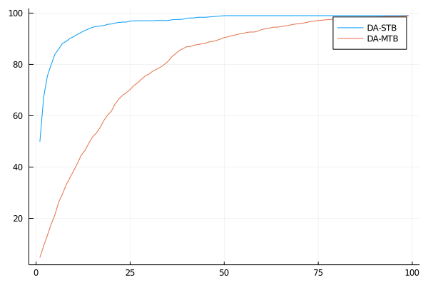

# DeferredAcceptance

&hellip is a superfast Julia implementation of a few variations of the deferred acceptance algorithm, which produce stable, incentive-compatible solutions to school-choice problems.

For a discussion of the DA-MTB and DA-STB algorithms and a few experimental results which I have attempted to reproduce here, consult the following reference:

- Ashlagi, Itai and Afshin Nikzad. 2020. &ldquo;What Matters in School Choice Tie-Breaking? How Competition Guides Design.&rdquo; *Journal of Economic Theory* 190, article no. 105120.

Here is a cool graph:

The code in this repository is much more performant than the Python code that lives [here](https://github.com/maxkapur/assignment), although the latter has more features. 

The author&rsquo;s homepage is [maxkapur.com](https://www.maxkapur.com/). 