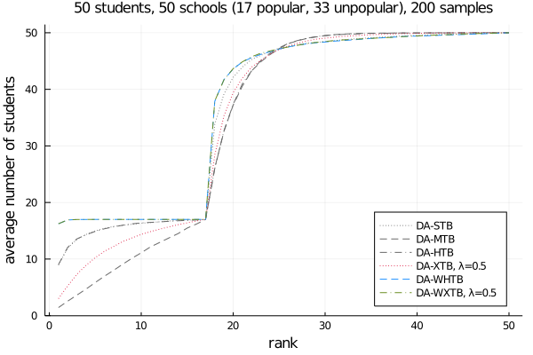
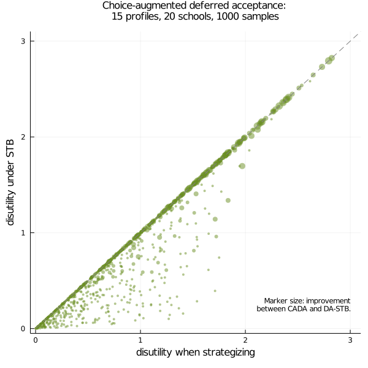
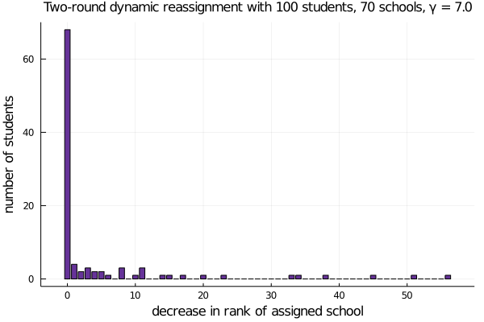
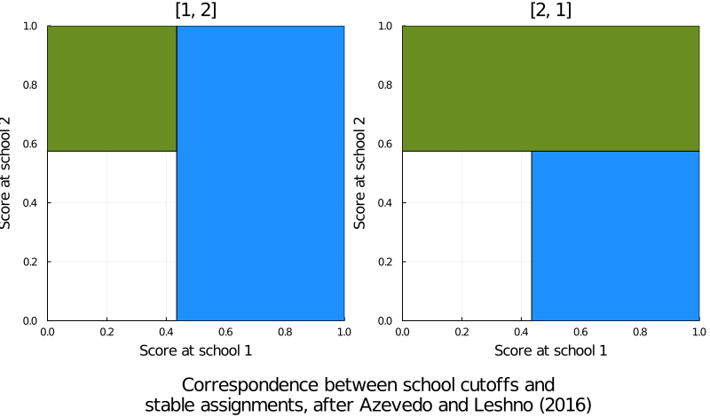
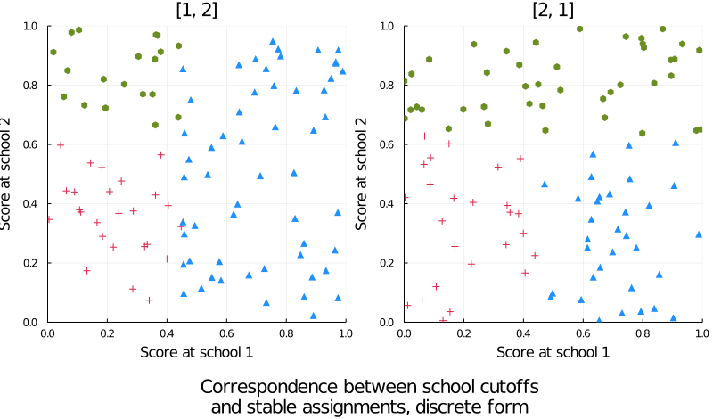
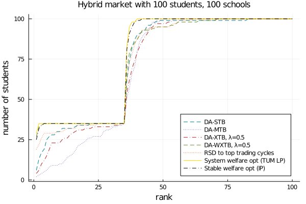

# DeferredAcceptance

&hellip; is an efficient Julia implementation of several school-choice algorithms, including the famous deferred acceptance (DA) algorithm in discrete and nonatomic forms, top trading cycles (TTC), and a number of popular tiebreaking methods.

The author&rsquo;s homepage is [maxkapur.com](https://www.maxkapur.com/).

## Usage
First, install the DeferredAcceptance package. You can do this from the Julia REPL by pressing `]` to enter package mode, then running `add DeferredAcceptance`.

Input some preference orders. The `2` in cell `(3, 4)` means that student `4` has named school `3` as her `2`nd choice. Similar data for the schools.

```julia
using DeferredAcceptance

students = [3 3 4 3 4 3 3 3 3 4;
            4 4 3 4 3 4 4 4 4 3;
            2 1 2 2 2 1 2 2 2 2;
            1 2 1 1 1 2 1 1 1 1]

schools = [1 5 7 5;
           1 1 1 1;
           5 1 1 1;
           5 1 1 1;
           10 9 7 8;
           1 5 4 5;
           5 1 4 1;
           8 5 7 8;
           8 9 7 8;
           1 5 4 5]

capacities = [3, 2, 2, 3]
```

Break ties and run the DA algorithm.

```julia
schools_tiebroken = STB(schools)
assn, ranks = DA(students, schools_tiebroken, capacities)
println(assn)
# [1, 3, 4, 4, 2, 3, 4, 1, 1, 2]
```

See `examples/Tutorial.jl` for a more verbose introduction.

## Background

### Mechanism-design perspective

In many public school systems, such as those in New York City, Boston, and Amsterdam, students apply for seats by supplying a strict ranking of the schools they would like to attend. Likewise, each school has a ranking of the students, favoring e.g. students who live nearby, have siblings at the school, or have high grades. Schools’ preferences are *not* strict. Each school places students of common favorability into categories and provides a ranking over the categories. In addition, each school has a limit on how many students it can accept, and we assume that schools would prefer any student over an empty seat. Each student may be assigned to at most one school.

The school-choice problem is, given the students’ and schools’ preference lists, what is the best way to assign students to schools? School-choice mechanisms generally attempt to accommodate a few important design considerations:
- The matches should be *stable.* For example, if Aretha likes Brad&rsquo;s school better than hers, and Brad&rsquo;s school likes Aretha better than Brad, then Aretha and Brad&rsquo;s school have an incentive to defect from the mechanism, and this matching is unstable.
- Ideally, the match should be *Pareto-efficient* in student welfare. If Aretha likes Brad&rsquo;s school better than hers, and Brad likes Aretha&rsquo;s school better than his, then they would be better off if they switched.
- The mechanism should be *incentive compatible.* This means that Aretha cannot obtain a better matching by lying about which school is her favorite.

If every student and school has a strict preference list, we can use `DA()` to find a stable assignment (it is often unique). But to address the general case, there are a family of tiebreaking mechanisms that we can use to convert loose preference lists into strict ones. Many of these are incentive compatible.

At the other extreme, when school preferences are weak (that is, schools consider many students interchangeable), we can use Pareto-improving cycles, implemented as `TTC_match()`, to search for student-optimal matches; this method is Pareto efficient but not incentive compatible.

### Market equilibrium perspective

Schools are like vendors in a competitive market, where students&rsquo; *scores* (on standardized tests, as derived from letters of recommendation, etc.) are analogous to *prices* they can afford to attend each school. Each school attempts to set the highest score cutoff it can while still filling its class.

A landmark paper by Azevedo and Leshno (2016) proposes a one-to-one relationship between *market-clearing cutoffs* and stable assignments. This result inspires a family of school-choice algorithms based on the concept of market equilibrium: `DA_nonatomic_lite()`, which searches for score cutoffs in a DA-like situation where a fixed percentage of students have a given preference list, and `nonatomic_tatonnement()`, which applies a general algorithm for computing equilibrium prices to school-choice equilibria.

## Comparison of tiebreaking mechanisms

Here is a cool graph, produced by the script `examples/Hybrid.jl`:



It compares the cumulative rank distributions associated with various DA tiebreaking rules in a simulated school-choice market involving 120 students and 120 seats. In overdemanded (popular) schools, single tiebreaking (STB) yields both better student welfare and greater equity than multiple tiebreaking (MTB), but MTB produces a more equitable distribution in underdemanded schools. A hybrid tiebreaking rule yields the best of both, but requires clairvoyance about which schools are popular and unpopular, a distinction that is less clear in real-world data (Ashlagi and Afshin 2020). Thus, a tiebreaking rule of my own creation (convex tiebreaking, XTB), parameterized in &lambda;, allows the market designer to freely modulate the welfare&ndash;equity tradeoff between MTB and STB without prior information about the relative popularity of the schools.

To discover a further extreme of the welfare-equality tradeoff phenomenon in underdemanded markets, we can use the student preference lists as primary tiebreakers; then, any of the four methods above can be used to break the remaining ties. This welfare tiebreaking rule (WTB) reflects the realistic assumption that a given school marginally prefers students who prefer it. WTB dominates STB in overdemanded markets, and in all markets, the difference between WXTB and WHTB (that is, WTB where secondary tiebreaking is performed by XTB or HTB, respectively) vanishes. WSTB is known as the &ldquo;Boston mechanism&rdquo; and is popular among parents even though it is not strategy proof; see [Target schools](#target-schools) below for a possible workaround after Abdulkadiroğlu et al. (2015).

## Target schools

As noted above, most of the obvious ways to optimize for student welfare when school preferences are nonstrict violate incentive compatibility--that is, they admit circumstances under which a student can obtain a better match by submitting a dishonest preference list. Abdulkadiroğlu et al. (2015) describe choice-augmented deferred acceptance (CADA), an incentive-compatible welfare-maximizing heuristic that works by having students supply a "target" school, where they will be given enhanced admission priority, in addition to their preference list. A demonstration included in the `examples/target/` directory shows that students who attempt to strategize by listing their target school as the first choice cannot obtain a match than that given by DA-STB (or -MTB). Moreover, the CADA matches offer a substantial improvement in welfare, as the following graph illustrates.



## Two-round dynamic reassignment

Feigenbaum et al. (2020) describe a two-round tiebreaking assignment mechanism that accounts for students who elect to drop out of the lottery (e.g., to attend private school). The implementation challenge here is coming up with realistic input data that reflect the likelihood of students receiving and accepting an outside offer. A sketch appears in the `examples/dynamic/` directory. Making some reasonable assumptions about the extent to which students&rsquo; outside options improve between rounds, I was able to empirically verify their central finding, which is that the second-round assignments dominate the first-round assignments rankwise, and using the reverse lottery numbers in the second round minimizes reassignment and improves equity by moving the students who did worst in the first round many ranks up their preference lists.



## Nonatomic formulation

An important insight obtained from the economic formulation described above is that stable matches can be encoded by a set of score *cutoffs* at each school. Then sending each student to the best school whose cutoff they exceed yields in a stable match. The set of cutoffs has a cardinality equal to the number of schools, which is typically reasonably small, and the challenge is coming up with a demand function that returns the percentage of students who will attend each school given the cutoff vector. I have provided several such functions in this module, including several based on the widely used multinomial logit choice model.

The charts below show an instance of overdemanded nonatomic DA, where half of the applicants prefer school 1 and half prefer school 2. The stable assignment has a distinctive Mondrian appearance, and generating a discrete DA instance with equivalently distributed student scores demonstrates the analogy between the nonatomic and discrete forms.





## The cost of stability

Considering the problem from a game-theoretic point of view invites us to compare the stable assignments produced by DA algorithms with the welfare-optimal assignment produced by relaxing the stability constraint. We can compute the latter using integer programming, as well as optimize for total (equivalently, average) welfare subject to stability. Integer programming is intractable for large problems, but as a proof of concept, are the results of a single 40-by-40 hybrid instance:



I have also included another heuristic welfare maximizer known as top-trading cycles (TTC) for comparison.

The code for this example can be found in the `examples/sysopt/` directory. I provide code that interfaces to several different solvers, but the defaults are the open-source GLPK and Cbc solvers.

The optimal stable assignment can be reportedly be computed in polynomial time using an algorithm due to Erdil and Ergin (2008), but I haven&rsquo;t implemented it yet.

## A note about performance

The code in this repository is much more performant than the Python code for the Gale-Shapley algorithm that lives [here](https://github.com/maxkapur/assignment), and thus I would recommend using this code to actually generate stable assignments in large problems. A 1000-by-1000 hybrid market like that shown in [Comparison of tiebreaking mechanisms](#comparison-of-tiebreaking-mechanisms) takes 17 seconds on my unremarkable computer. Overdemanded markets generally take longer than underdemanded markets.

For the purposes of estimating the characteristics of a school market&mdash;for example, seeing which schools have the most competition&mdash;the nonatomic formulation is much more computationally tractable.

## Ideas for future functionality

It would be useful to define comparison operators `⪰` and such that compare whether matches rankwise dominate one another. This won&rsquo;t be difficult to implement, but I haven&rsquo;t decided on an intuitive syntax yet.

## References

- Abdulkadiroğlu, Atila, Yeon-Koo Che, and Yosuke Yasuda. 2015. &ldquo;Expanding &lsquo;Choice&rsquo; in School Choice.&rdquo; *American Economic Journal: Microeconomics* 7, no. 1 (Feb.): 1&ndash;42.
- Ashlagi, Itai and Afshin Nikzad. 2020. &ldquo;What Matters in School Choice Tie-Breaking? How Competition Guides Design.&rdquo; *Journal of Economic Theory* 190 (Oct.), article no. 105120.
- Azevedo, Eduardo M. and Jacob D. Leshno. 2016. &ldquo;A Supply and Demand Framework for Two-Sided Matching Markets.&rdquo; *Journal of Political Economy* 124, no. 5 (Sept.): 1235&ndash;68.
- Erdil, Aytek and Haluk Ergin. 2008. &ldquo;What&rsquo;s the Matter with Tie-Breaking? Improving Efficiency in School Choice.&rdquo; *The American Economic Review* 98, no. 3 (June): 669&ndash;89.
- Feigenbaum, Itai, Yash Kanoria, Irene Lo, and Jay Sethuraman. 2020. “Dynamic Matching in School Choice: Efficient Seat Reassignment After Late Cancellations.” *Management Science* 66, no. 11 (Nov.) 5341–61.
- Nisan, Noam, Tim Roughgarden, Éva Tardos, and Vijay V. Vazirani, eds. 2007. *Algorithmic
Game Theory.* Cambridge University Press.
- Roth, Alvin E. 1982. &ldquo;The Economics of Matching: Stability and Incentives.&rdquo; *Mathematics of Operations Research* 7, no. 4 (Nov.): 617&ndash;28.
